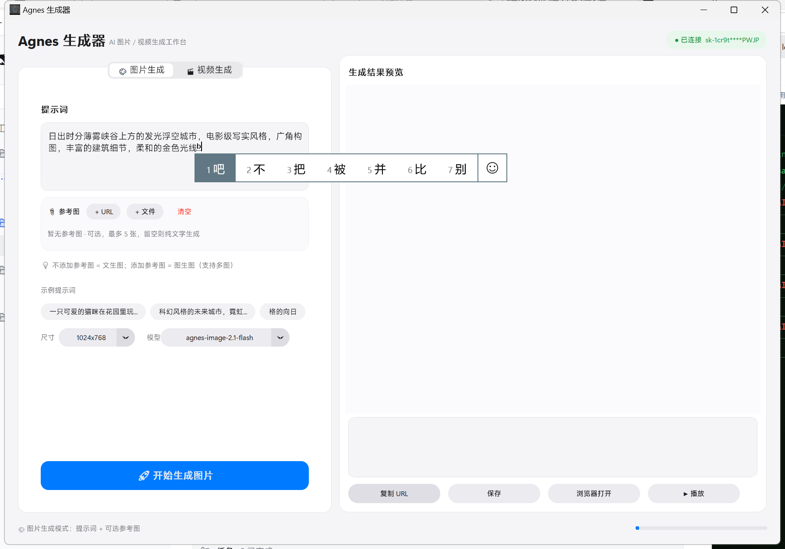
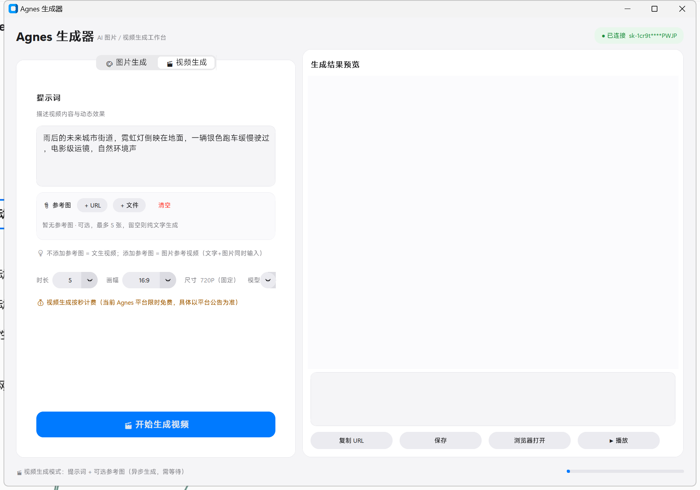

# Agnes Studio

> **A lightweight, free multimodal desktop playground (text-to-image & text-to-video) for students and beginners to learn and build with multimodal agents.**

一款基于 Agnes API 的**桌面端图片 / 视频生成小工具**：文生图、图生图、文生视频、图片参考视频四合一，配历史记录、参数回填与一键打包 EXE。免费、零门槛、可离线回看，是学生和初学者**接触、学习与使用多模态智能体**的入门级练手项目。

<div align="center">

[](https://github.com/q93304989-bit/AgnesStudio/stargazers)
[](LICENSE)
[](https://www.python.org)
[](#)
[](https://www.agnes-ai.com)

[English](#english) · [快速开始](#快速开始) · [功能一览](#功能一览) · [打包 EXE](#打包为-exe) · [常见问题](#常见问题)

</div>

---

## 为什么要做 Agnes Studio？

你可能已经听过 Sora、Runway Gen-3、Kling、Veo、Pika 这些名字——它们是当下**第一梯队**的视频生成模型，画质惊艳、价格不菲、门槛也高。

> **Agnes Studio 不打算和它们同台竞技。**

它是一条**完全不同的路**：把当前阶段可以免费或低成本接入的 **Agnes 多模态 API** 装进一个本地 GUI，让学生、初学者、自学者用一杯咖啡的时间就能：

- 在桌面里点几下生成第一张图、第一段视频；
- 看到「文本 → token → 异步任务 → 轮询 → 渲染」一条完整链路是怎么跑的；
- 改提示词、加参考图、调尺寸、改模型，**亲手摸一遍多模态智能体的工作流**；
- 把代码读下来、跑起来、打包成自己的 EXE，作为第一个能写在简历里的「我与 AI 写过东西」的项目。

> 💡 **它不是顶配，但它是大多数学生能找到的第一把钥匙。**

| 模型梯队 | 代表 | Agnes Studio 的定位 |
|---------|------|---------------------|
| 第一梯队（付费 / 邀请制） | Sora、Runway Gen-3 Alpha Turbo、Kling 1.6、Veo 2、Pika 2.0 | ❌ 不参与对比 |
| 第二梯队（开放但常有限额） | Agnes 图像 / 视频 API | ✅ **本项目默认后端** |
| 自部署 / 本地模型 | Stable Diffusion、Wan2.1、CogVideoX | 留给进阶玩家 |

---

## 适合谁？

- 🧑‍🎓 **学生**（高中 / 本科 / 研究生）：想上手跑通「AI 生成图片 / 视频」项目，但学校机子没有 GPU，也不想折腾 Linux 部署；
- 🧑‍💻 **转行 / 自学者**：刚学完 Python 基础，想做一个能放在简历里的 GUI + HTTP + 异步任务小项目；
- ✍️ **独立创作者 / 自媒体**：临时需要一张配图、一段短素材，不想给 Sora / Runway 充值；
- 🛠 **任何想把多模态 API 接进桌面工具的人**：源码就是最好的学习材料，5000 行 Python 不算多也不算少。

> 不需要 GPU，不需要懂 Diffusion，不需要懂 Transformer；会装 Python 依赖 + 拿一个 API Key 就能跑起来。

---

## 功能一览

### 🎨 图片生成
- **文生图**：输入提示词，一键生成（默认 `agnes-image-2.1-flash`）；
- **图生图**：可选 **最多 5 张**参考图（公网 URL 或本地文件，自动转 base64 / data URI）；
- **7 种尺寸**：1024×768 / 512×512 / 768×1024 / 1024×1024 / 1280×720 / 720×1280 / 1920×1080；
- **多模态参考**：同时传图 + 文字，模型会融合参考图的风格 / 主体。

### 🎬 视频生成
- **文生视频 / 图片参考视频**：同一界面自动识别，无参则文生视频，有参则图参考视频；
- **5 档时长**：4 / 5 / 8 / 10 / 12 秒；
- **6 种画幅**：16:9 / 9:16 / 1:1 / 4:3 / 3:4 / 21:9（统一 720P 基准）；
- **3 个模型**：`agnes-video-2.5-flash`（限时免费）/ `agnes-video-2.5` / `agnes-video-v2.0`；
- **异步任务**：后台线程提交 + 1.5 秒轮询，不阻塞界面，状态栏实时显示进度。

### 🕘 历史记录（自带本地数据库）
- 自动落盘到 `F:\AgnesGeneratorData\`（可在设置改路径），**重启不丢**；
- 按 **全部 / 图片 / 视频** 筛选 + 关键词搜索；
- **一键载入参数**：把当时用的提示词、模型、尺寸、参考图全部回填到生成页，微调重跑；
- 图片本地缓存（缩略图离线也能回看），视频按需下载，**最多保留 500 条**自动滚动。

### ⚙️ 设置中心
- 🔑 **密钥管理**：编辑 `AGNES_API_KEY` / `AGNES_BASE_URL`，**一键测试连接**（显示耗时与 HTTP 状态码）；
- 🖼 **图床配置**：视频参考图自动上传到 **GitHub 公开仓库（免费）** 或 **S.EE（付费）**；
- 🎛 **生成默认值**：图片 / 视频的模型、尺寸、时长，画幅保存为下次默认；
- 🌐 **网络模式**：自动（直连优先，失败换代理） / 仅直连 / 仅系统代理——专治代理不稳定的场景；
- 🎨 **主题**：跟随系统 / 浅色 / 深色（CustomTkinter）；
- 📂 **存储路径**：数据目录可改，可一键打开。

### 🧰 其它
- 一键 **复制 URL / 保存到本地 / 浏览器打开** / 系统播放器播放视频；
- **网络自适应**：直连 + 系统代理自动协商，对国内网络环境做了开关；
- **PyInstaller 打包**：单文件 EXE（已自带 spec），无 Python 也能跑。

---

## 快速开始

### 1. 克隆 & 装依赖

```bash
git clone https://github.com/q93304989-bit/AgnesStudio.git
cd AgnesStudio
pip install -r requirements.txt
```

### 2. 申请一个 Agnes API Key

到 [Agnes AI 控制台](https://www.agnes-ai.com) 注册账号 → 创建 API Key → 复制 `sk-xxx...` 备用。
> ⚠️ Agnes 视频部分档位限时免费，请关注官方政策变动。

### 3. 配置环境变量

复制 `.env.example` 为 `.env`：

```bash
cp .env.example .env       # macOS / Linux
copy .env.example .env     # Windows
```

打开 `.env`，**至少填一项**：

```env
AGNES_API_KEY=sk-your-key-here
AGNES_BASE_URL=https://apihub.agnes-ai.com/v1
```

> 如果你打算做**视频参考图**（把本地图片塞给视频生成），再多填一段图床配置（二选一）：
> ```env
> # 免费方案：GitHub 公开仓库 + PAT（勾 public_repo）
> GITHUB_TOKEN=ghp_xxxxxxxx
> GITHUB_REPO=your-name/your-image-repo
> ```
> 不知道怎么建？搜一下「GitHub PAT 申请 + 创建公开仓库」即可。

### 4. 启动

```bash
python main.py
```

首次启动会自动在 `F:\AgnesGeneratorData\`（Windows 默认）下创建历史目录。

---

## 截图

| 图片生成 | 视频生成 |
|:---:|:---:|
|  |  |

## 🎬 宣传视频

30 秒产品宣传片（1920×1080 @ 30fps）：


> 若上方播放器未加载，可到 [Releases v1.0.0](https://github.com/q93304989-bit/AgnesStudio/releases/tag/v1.0.0) 的 Assets 里直接播放或下载 `docs/promo.mp4`。

成片与渲染工程都在 [`docs/promo/`](docs/promo/)，可自行复渲：

```bash
cd docs/promo
npm install
npx remotion render src/index.ts AgnesPromo out/promo.mp4
```

> 用 [video-shotcraft](https://github.com/Vincentwei1021/video-shotcraft) 制作：Remotion + 真实界面截图 + 2.5D 运镜 + 节奏卡点。设计说明见 [`docs/promo/DESIGN.md`](docs/promo/DESIGN.md)。

---

## 支持的参数

### 🖼 图片

| 参数 | 可选 |
|------|------|
| 模型 | `agnes-image-2.1-flash`（默认） |
| 尺寸 | `1024x768` / `512x512` / `768x1024` / `1024x1024` / `1280x720` / `720x1280` / `1920x1080` |

### 🎬 视频

| 参数 | 可选 |
|------|------|
| 模型 | `agnes-video-2.5-flash`（限时免费）/ `agnes-video-2.5` / `agnes-video-v2.0` |
| 时长 | `4` / `5` / `8` / `10` / `12` 秒 |
| 画幅 | `16:9`(1280×720) / `9:16`(720×1280) / `1:1`(720×720) / `4:3` / `3:4` / `21:9` |
| 分辨率 | 720P 基准 |

---

## 项目结构

```
AgnesStudio/
├── main.py              # 主程序（GUI：图片 / 视频 / 历史记录 / 设置）
├── agens_core.py        # Agnes 图像生成核心（文生图 / 图生图）
├── video_core.py        # Agnes 视频生成核心（异步任务 + 轮询）
├── history_store.py     # 历史记录存储（JSON 索引 + 本地图片缓存）
├── history_ui.py        # 历史记录面板 UI（筛选 / 搜索 / 卡片列表）
├── gallery_ui.py        # 生成结果画廊 UI
├── app_config.py        # settings.json 读写 + 默认值管理
├── http_session.py      # 统一 HTTP 会话（自适应网络模式）
├── image_host.py        # 图床上传（GitHub / S.EE）
├── ui_theme.py          # 主题（CustomTkinter + 跟随系统）
├── ui_anim.py           # 简易动画与过渡
├── gen_icon.py          # 图标生成
├── requirements.txt     # Python 依赖
├── .env.example         # 环境变量样例（不含真实密钥）
└── app_icon.png / app_icon.ico
```

> 一次性调试脚本（`_*.py` / `canvas_*.png` / `ap_*.eps` 等）已在 `.gitignore` 排除；打包产物 `build/` / `dist/` 与真实密钥 `.env` 永不提交。

---

## 打包为 EXE

```bash
pyinstaller --noconfirm --onefile --windowed ^
  --name "AgnesStudio" ^
  --add-data ".env;." ^
  --add-data "app_icon.png;." ^
  --icon app_icon.png ^
  main.py
```

或直接用本仓库的 spec：

```bash
pyinstaller AgnesImageGenerator.spec
```

> 打包后把 `.env` 放在 EXE 同级目录即可。

---

## 常见问题

<details>
<summary><b>为什么视频生成有时排队很久？</b></summary>

Agnes 视频队列公共资源紧张时会返回 `video_queue_full`(503) 或 `rate_limit_exceeded`(429)，本工具已内置自动指数退避重试；遇到只是「慢」，不是「错」。

</details>

<details>
<summary><b>本地图片可以直接喂给视频生成吗？</b></summary>

**目前不行**——Agnes 视频接口对 base64 / data URI 的支持在 2026-08-25 实测均返回 400；只能传**可公网访问的 URL**。所以本工具会先自动上传到 GitHub 公开仓库或 S.EE 图床，拿到 URL 再喂给视频 API。**图片生成页**则本地 / URL 都支持。

</details>

<details>
<summary><b>Agnes 模型到底是什么水平？</b></summary>

明确回答：**它不是 Sora / Runway / Veo 那一档**。在美学一致性、镜头运动、运镜自由度上还有明显差距。但在**写实摄影、产品图、卡通风格化、二次元立绘**等任务上 720P 短视频已经达到「能直接发抖音 / B 站二创」的可用线。它的优势是**免费档位 + 中文提示词友好 + API 稳定**——对学生入门来说，性价比远超第一梯队。

</details>

<details>
<summary><b>数据安全？</b></summary>

- 所有历史记录、媒体缓存都**只存在你本机的 `F:\AgnesGeneratorData\`**；
- 密钥只在**你自己电脑的 `.env`**里；
- **不会**经过任何第三方服务器（除 Agnes API 与你自选的图床外）；
- **不上传任何遥测**。

</details>

<details>
<summary><b>如何在 Linux / macOS 上跑？</b></summary>

主要 UI 用的是 CustomTkinter（基于 Tk），三大平台都能跑；但默认数据目录 `F:\AgnesGeneratorData\` 是 Windows 风格硬编码，Linux / macOS 第一次启动会自动回退到 `~/.agnes_generator/`。建议在「设置 → 文件存储地址」里改成你想要的位置。

</details>

---

## 学习路线建议

如果你打算把 Agnes Studio 作为**多模态入门练手项目**，建议顺着源码看：

1. `agens_core.py` —— 一个最干净的「请求 → 响应」HTTP 调用；
2. `video_core.py` —— **异步任务 + 状态轮询**的教科书实现；
3. `http_session.py` —— 直连 / 系统代理自动协商；
4. `main.py` —— 用 CustomTkinter 写的 3000+ 行 GUI：3 个标签页 + 设置中心；
6. `history_store.py` —— 一个不需要数据库也能跑得很稳的 JSON 索引方案。

读完后你可以试着加：导出 GIF、保存提示词模板、批量生成等小功能。

---

## 路线图

- [ ] 支持更多模型 / API 端点（DeepSeek、智谱、千问一键切换）
- [ ] 历史记录导出（JSON / CSV / Markdown）
- [ ] 多语言界面（英文 / 简体中文）
- [ ] 简单调参面板（CFG、seed、steps）

---

## 许可证

本项目仅供学习与个人创作使用，**禁止商用**。

调用 Agnes API 时请遵守 [Agnes 服务条款](https://www.agnes-ai.com)。

---

## 致谢

- [Agnes AI](https://www.agnes-ai.com) —— 提供学生也能用的免费 / 低价多模态 API。
- [CustomTkinter](https://github.com/TomSchimansky/CustomTkinter) —— 让 Tk 也能有现代质感。
- 所有提 PR / Star / Issue 的人。

---

<a name="english"></a>

## English Summary

**Agnes Studio** is a lightweight desktop GUI (Python + CustomTkinter) that wraps the **Agnes multimodal API** for both **text-to-image** and **text-to-video** (with optional image references). It is deliberately **not** competing with Sora / Runway / Veo — those are tier-1 models with tier-1 pricing. Instead, Agnes Studio targets **students, beginners and indie creators** who want a free, low-friction way to:

- Generate their first AI image / video in 30 seconds;
- Inspect a complete multimodal pipeline (prompt → async task → poll → render);
- Read 5000 lines of beginner-friendly Python and learn GUI + HTTP + async task by example;
- Package it as a single EXE and put it on a resume.

Run with `pip install -r requirements.txt`, fill `.env` with `AGNES_API_KEY`, then `python main.py`.